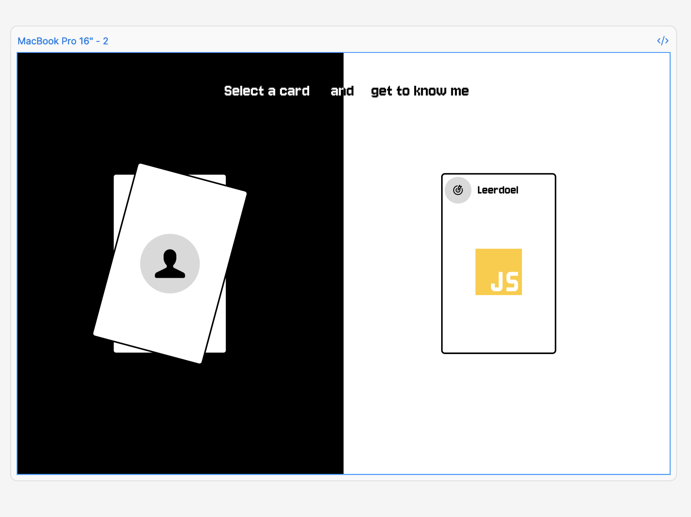
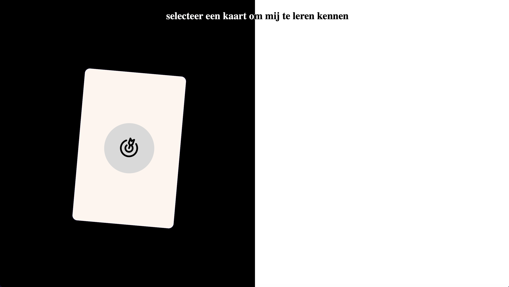
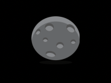
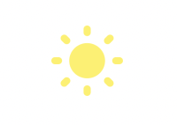

# Leerdoelen 
**Leerdoel 1**
Ik wil beter worden in CSS annimeren, omdat ik vind dat annimaties een website veel leuker kan maken.

**Leerdoel 2**
Ik wil beter worden in javscript. Op dit moment heb ik het gevoel dat ik de code niet altijd heel goed begrijp. Ik wil het maken van functies beter begrijpen om met meer vertrouwen javascript te kunnen gebruiken.

**Leerdoel 3**
Ik wil mijn vaardigheden in het schrijven van nette, goed gestructureerde code verbeteren. Hiermee bedoel ike goede code-hygiëne, zoals het gebruiken van duidelijke variabelen, overzichtelijke indeling en het toevoegen van commentaar die verteld wat de code doet.
***
# Week 1
## Dag 1/2

**Wat heb ik vandaag gedaan:**
Vandaag heb ik de workshop Directus → FETCH → JSON → HTML gevolgd waar we over de basics hebben gesproken van html,css en javascript. Het ging over hoe je je html-bestanden aanmaakt en de css en javascript kan linken. Vervolgens hebben we het over variable en functies gehad. Toen we het over javascript functies hebben gehad kon ik het totaal niet volgen omdat we een ander manier van functies schrijven hebben gehad wat te snel voor mij ging. Na de workshop ben ik verder gaan werken aan mijn website. Ik ben best vergekomen met de site, wat ik eigelijk niet had verwacht.


**Hoelang duurde het:**
Het duurde mij 4 uurtjes om tot een idee en figma design te komen. 

Het duurde mij 6 uurtjes om mijn ontwerp te coderen zoals het nu eruit ziet.


**Wat heb ik geleerd:**
Ik heb veel leermomenten Gehad tijdens het coderen van mijn ontwerp. Ik heb gewerkt met een aantal nieuwe declaraties zoals:

`perspective: 1000px;` om diepte te geven (3d effect)

`mix-blend-mode: difference;` om kleur effect te krijgen net als blend mode in figma of ilustrator

`transition: 1s cubic-bezier(0.34, 1.56, 0.64, 1); ` Ik heb hier kennis gemaakt met cubic bezier wat zorgt voor een EASING effect.

`translate: 50vw 0 calc(sibling-index() * -5em);` de eerste waarde verteld de waarde van de x-ass(horizontaal) de tweede verteld de y-ass(verticaal) en de derde de z-ass (hoe ver of dichtbij). de laatste waarde telt welke nummer het element heeft en plaatst dat * -5 em naar achter.

`backface-visibility: hidden; ` dit zorgt ervoor dat als we de rug van de element zien dat het hidden is.

`transform-style: preserve-3d;`dit bepaald dat de element zich moet gedragen als een 3d element

**Wat ga ik morgen doen:**
Morgen ga ik de workshop HTML rulez bij wonen en daarna verder met mijn ontwerp. Ik ga het ontwerp verder stylen zoals ik dat in figma heb gemaakt. Ik ben al best ver gekomen dus ik moet nu even kijken wat ik nog kan toevoegen om zelf meer te leren.

## Dag 3
**Wat heb ik vandaag gedaan:**
Vandaag ben ik bezig geweest het het responsive maken van mijn website en heb ik de workshop HTML basics bij gewoond. Ik ben ook verder gegaan met het maken van de checkout van gister die ik nog niet af had.

**Hoelang duurde het:**
Het duurde 2 uurtjes om mijn design responsive te maken.

**Wat heb ik geleerd:**
Ik heb vandaag geleerd dat er rond de 100 HTML selectoren zijn. Eerder dacht ik dat er meer waren. Ik heb ook kennis gemaakt met een detail list en en de items die je daar in kan toevoegen.

**Wat ga ik morgen doen:**
Morgen ga ik mijn ontwerp precenteren en wil ik daarna een api geruiken om gegevens op te halen die vervolgens in mijn kaarten worden ingevuld.

## Weekly Nerds (Stop using Js.. In the future)
<details>
  <summary>Notes</summary>
Weekly Nerd: Killian Valkhof (Stop using Js.. In the future)

Er wordt nog vaak gebruik gemaakt van javascript terwijl dat niet nodig is. 

Choose the least powerfull engin. Browser kunnen sneller en beter werken met html en css. De browser moet veel moeite doen om javascript te tonen.

Oude websites die blijven werken in de nieuwe browser versie. Dat is omdat het zo is afgesproken. Dus mensen die een oude code taal gebruikte daar nog steeds meer door kunnen gaan.

Custom switch

Code: Appearance none: ik wil niet dat dit gestyled wordt als een form element maar ik wil het zelf gaan stylen. Hierdoor veranderd de input in een sort div.

Input:: Before: input kan je dan gebruiken als achtergrond en den bolletje is dan de before.

Input:: checked: zorgt ervoor dat het transformeerd zodra er op geklikt wordt. Je kan dan een sort on click maken die geen javascript nodig heeft.
 
Leugen: forms zijn moeilijk te stijlen. Dit klopte 10 jaar geleden omdat de browser al standard input elementen had.

Focus
Wordt gebruikt wanneer een gebruiker met zijn toetsebord door de website heen tab. Als je geen focos maakt dan krijgt het de standaard focus die de browser mee geeft.

<input type=”checkbox” switch/> zorgt ervoor dat je een checkbox kan laten renderen al seen switch in de browser. (werkt alleen in safari)

In-page transition
Html { scroll-behavior: smooth} verteld de browser om ergens naar toe te scrollen met een annimatie. Zo hoef je geen javascript te gebruiken wat de performance befordered.

@media (Prefers-reduce-motion: 
no prefrence) {html{
scroll-behavour: smooth}
}
Zorgt ervoor dat als iemand in zijn browser setting reduce motion aan heeft staan dan zorgt het ervoor dat er geen annimatie zijn.

Scroll-margin 
zorgt ervoor dat wanneer je helemaal boven aan scrolled de tekst of andere content niet onder een header komen door de margin die je toevoegd.

Target Pseudo element
Accordians
Details en summary element samen zorgt voor een soort drop down die die alleen de summary toont als het dicht geklapt is. Alles wat er onder is zo als een p wordt pas getoond als je het open zet.

Elke keer dat je het open zet geeft de browser de open attribut aan de details element.

::marker Pseudo element kan je gebruiken om de marker van de details element te wijzigen. Net als bij een UL of OL. Dan kan je het pijltje of nummer wijzigen.

:hover seudo element kan je gebruiken om de state van het element veranderen als je met je muis over het element gaat.

Name= als je meerdere details dezelfde naam hebben dan gaat er maar 1 detail open. Dus als je een andere opent dan gaat de vorige dicht.

Dialog
Zijn pop-ups. Het is niet meer dan een div die standaard onzichtbaar is. Je hebt hier dan een on clickfunctie nodig om het open en dicht te maken.

:backdrop Pseudo element zorgt ervoor dat er een chtergrondje over jewebsite komt.

@starting-style kan je gebruiken om dialog te gebruiken om te animeren.

</details>

# Week 1 verslag

**Algemeen verslag:**

In week 1 heb ik mijn Figma-ontwerp naar werkende HTML/CSS vertaald en interactieve kaarten gemaakt die omklappen (draaien) en geschud kunnen worden met JavaScript. Ik heb ook fetch gebruikt om een naam uit de api te laden.

**Belangrijkste onderdelen:**

- Gecodeerd prototype en afbeeldingen:

  - 
  - 

- codevoorbeelden:

  HTML (kaartstructuur):

  ```html
  <li class="kaart">
    <div class="voorkant"> <!-- svg / icoon --> </div>
    <div class="achterkant"> <!-- titel, afbeelding, tekst --> </div>
  </li>
  ```

  CSS (3D flip):

  ```css
  .kaartul { perspective: 5000px; }
  .kaart { transform-style: preserve-3d; transition: 1s cubic-bezier(0.34,1.56,0.64,1); }
  .voorkant, .achterkant { backface-visibility: hidden; position: absolute; inset: 0; }
  .achterkant { transform: rotateY(180deg); }
  .kaart.kaartGedraaid { transform: rotateY(0.5turn); }
  ```

  JavaScript (shuffle + fetch):

  ```js
  // shuffle: verplaatst kaarten willekeurig
  function shuffle() {
    const kaarten = document.querySelectorAll('.kaart');
    const lijst = document.querySelector('ul.kaartul');
    let n = kaarten.length;
    while (--n > 0) {
      const i = Math.floor(Math.random() * (n + 1));
      lijst.appendChild(kaarten[i]);
    }
  }

  // fetch voorbeeld: naam in header
  async function tekstInvoegen() {
    const URL = 'https://fdnd.directus.app/items/person/293';
    const res = await fetch(URL);
    const data = await res.json();
    document.querySelector('h1').textContent = data.data.name;
  }
  ```

Kort: week 1 ging vooral over het omzetten van een ontwerp naar code, leren werken met 3D-transformaties en het toevoegen van basisinteractie met JavaScript.

# Week 2
## Dag 1
**Wat heb ik vandaag gedaan:**
Vandaag ben ik bezig geweest met het maken van een fetch van alle studenten om dat dan vervolgens in een ticker te zetten die oneindig scrolled. De ticker heb ik kunnen maken met alleen wat css wat heel lastig was om informatie over te vinden. door een youtube video te volgen heb ik het uiteindelijk kunnen doen.

ik heb vandaag ook de workshop van sanne gevolgd over het doen van een fetch en dat dan omzetten in json en dan weer omzetten naar html.

**Hoelang duurde het:**
om de fetch en de ticker helemaal werkende te krijgen duurde het mij ongeveer 5 uurtjes. ik kwam steeds tegen dingen aan wat ervoor zorgde dat lang bezig was met het fixen van problemen.

**Wat heb ik geleerd:**
Ik heb geleerd dat het hel belangrijk is dat je juiste selector selecteerd in css omdat je anders ook andere elementen kan aanroepen wat kan zorgen dat meerdere elementen aangepast worden.

**Wat ga ik morgen doen:**
morgen ga ik mijn twee themas maken die aangepast kan worden door een knop.

## Dag 2
**Wat heb ik vandaag gedaan:**
vandaag ben ik bezig geweest met het maken van de light en dark-mode. Het maken van de light en dark-mode functie ging best snel maar ik wilde in plaats van een knop een slider hebben wat me helaas niet was gelukt.

**Hoelang duurde het:**
het maken van de light en dark-mode functie duurde mij ongeveer 1 uur

**Wat heb ik geleerd:**
Tijdens de typografie cursus heb ik geleerd je mask kan gebruiken om een afbeelding in typgrafie te kunnen tonen. Ik heb ook geleerd dat dit mogelijk is met een autoplay video kan.

Wat ik ook interesant vond is dat er een soort standard is over de lengte van een tekst vlak. Volgens vassiles is dit een lengte tussen 20 en 40 em. Dit om het niet moeilijk te maken voor de lezer om naar de volgende zin te gaan.

**Wat ga ik morgen doen:**
morgen wil ik de dark en light mode knop annimeren zodat het als een slider gaat sliden wanneer je erop klikt.

Ik wil ook een kaart vullen met informatie van een random student.

## Dag 3
**Wat heb ik vandaag gedaan:**
ik heb een code review gedaan aan de hand van de fdnd website.

 Ik ben best lang bezig geweest met het proberen te animeren van de slider maar het het lukte helaas niet. Ik heb daarom ervoor gekozen om alleen de afbeelding te veranderen on click. Ik ben ook bezig geweest met het maken van de functie voor het invullen van een kaart met student informatie. Ik heb weer gebruik kunnen maken van een mathrandom statement wat ik vaker wil gaan oefenen om beter te begrijpen.

**Hoelang duurde het:**
het proberen te annimeren van de slider duurde mij zo een 3 uurtje fouten maken en 2 uurtjes om het goed te doen.

Het maken van de studenten kaart functie te maken ging best vlot maar de mathrandom duurde mij iets langer omdat ik dat nog lastig vind om te maken. het duurde mij ongeveer 3 uurtjes in totaal.

**Wat heb ik geleerd:**
Ik heb geleerd dat het toevoegen van meerdere classes met javascript best ingewikkeld is. ik wilde meerdere classen toevoegen en af halen maar dat lukte me niet waardoor ik de light en dark-mode knop niet kon annimeren.

**Wat ga ik morgen doen:**
Morgen ga ik mijn werk presenteren.

## Week 2 verslag

**Algemene samenvatting week 2:**

In week 2 heb ik mij verder verdiept in het werken met fetch, het dynamisch vullen van HTML met data van een api. Zo heb ik een functie kunnen schrijven die 1 kaart vult met informatie van een random student.


Ik heb geleerd hoe je met CSS en JavaScript interactieve elementen zoals een ticker en een themaswitcher kunt maken die tussen light en dark-mode kunnen togglen. 
 

Ook heb ik ervaren dat het belangrijk is om goed te letten op selectors en het structureren van mijn code. Ik kwam er namelijk achter dat ik meerdere elementen aansprak toen ik meer code ging toevoegen.

Tijdens week 2 heb ik kunnen vallen en kunnen slagen, zoals het animeren van een slider en het werken met random data.

Het maken van de slider is mij helaas niet gelukt wat ik in de toekomst toch opnieuw wil gaan proberen. Ik wilde een slider maken die de maan naar links annimeerd als je op de knop klikt maar dat lukte maar niet. Wat wel positief is is dat ik kennis heb gemaakt met de background image style van CSS. Die ik heb gebruikt om de image source te wijzigen on click met een variable.

Maar waar ik wel blij om ben is dat ik voor het eerst een functie met mathrandom heb kunnen schrijven zonder hulp. Ik heb twee van dit soort functies in mijn code. Bij de eerste ben ik begeleid door sanne. Ik heb vervolgens om nog eentje te maken om zelf ermee te kunnen oefenen.

# Bronnen
Luxford, C. (2024, 10 oktober). How to do I make the flip card feature work? Stack Overflow. https://stackoverflow.com/questions/79074420/how-to-do-i-make-the-flip-card-feature-work

Marlius. (2017, 7 juni). Items that span all columns/rows using CSS grid layout. Stack Overflow. https://stackoverflow.com/questions/42239778/items-that-span-all-columns-rows-using-css-grid-layout/

W3Schools.com. (z.d.). https://www.w3schools.com/css/css_positioning.asp
